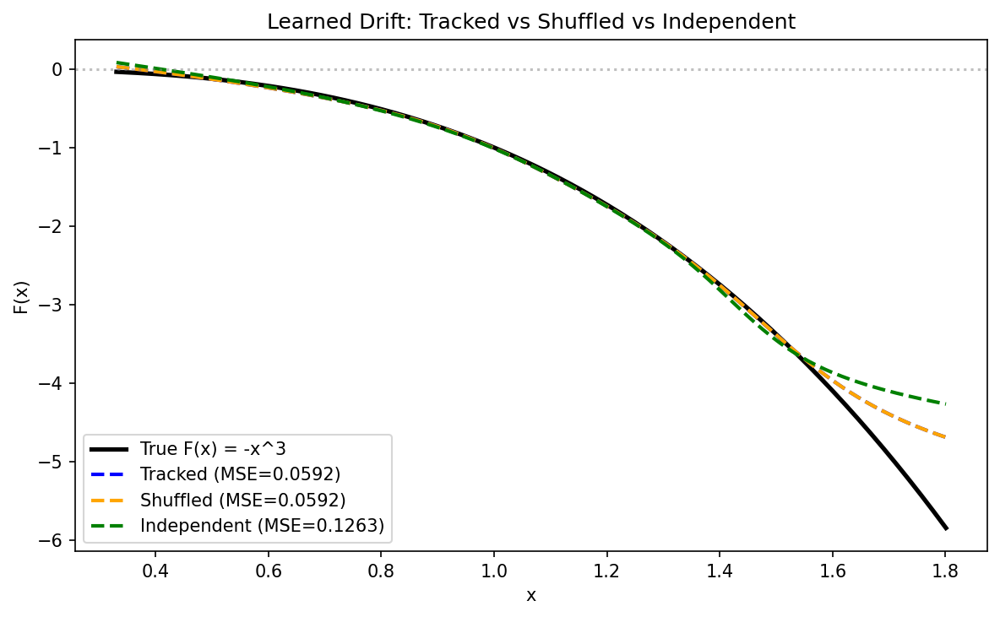
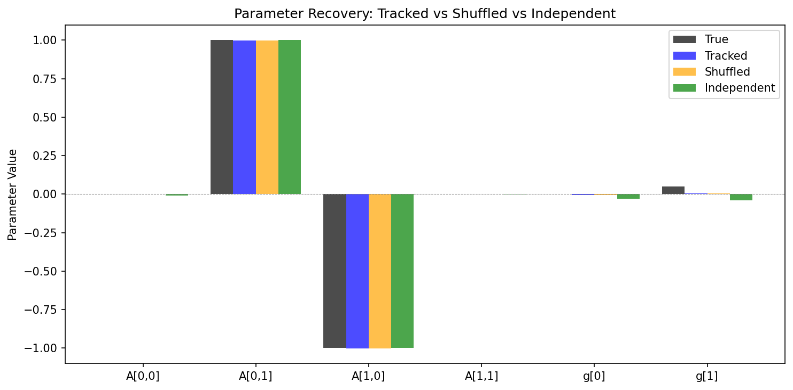
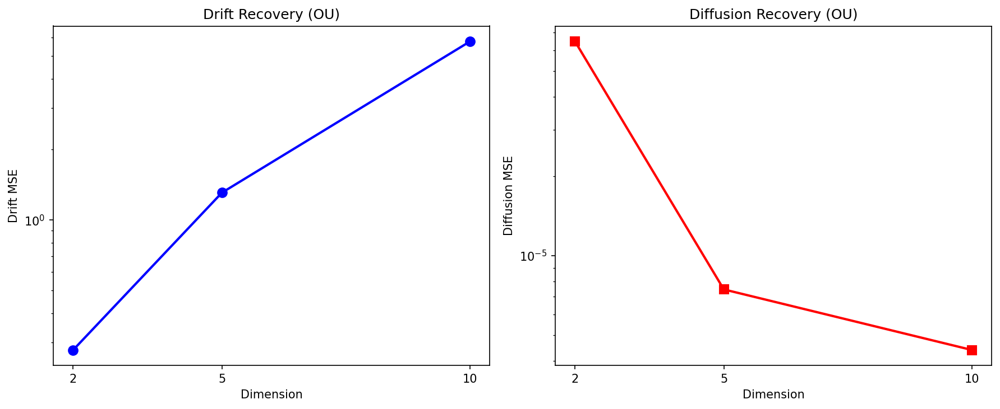
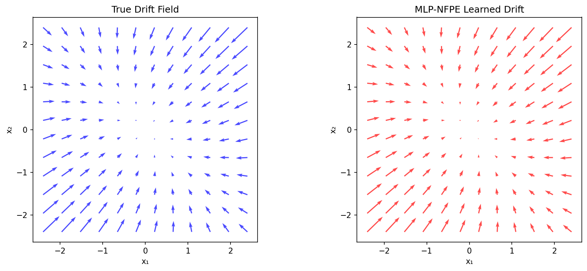
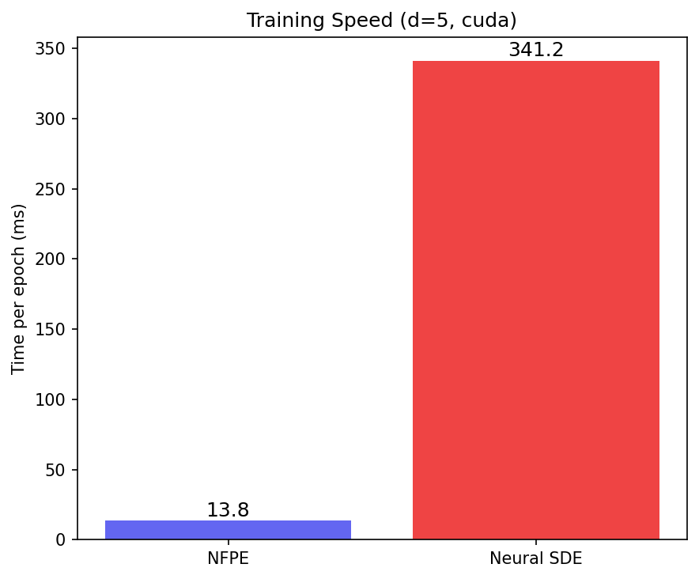

# Neural Fokker-Planck Equations (NFPE)

**Learning stochastic differential equations from distribution snapshots via deterministic moment dynamics.**

<p align="center">
  <br>
  <em>Nonlinear drift recovery: NFPE learns the true cubic drift F(x) = −x³ from distribution snapshots alone — no trajectories, no density estimation, no SDE simulation.</em>
</p>

> **No SDE simulation. No density estimation. No trajectory tracking.**
> NFPE learns both drift and diffusion from distribution snapshots using only sample means and covariances — 24× faster than Neural SDEs.

NFPE learns both the drift $F$ and diffusion $B$ of an unknown SDE

$$dX = F(X)\,dt + B(X)\,dW_t$$

by converting the stochastic learning problem into a deterministic optimization over Gaussian moments.

## The Method

### Moment ODEs

Under Gaussian closure, the Fokker-Planck equation reduces to ODEs on the moments of each mixture component $k$:

$$\dot{\mu}_k = F(\mu_k)$$

$$\dot{\Sigma}_k = D_F(\mu_k)\,\Sigma_k + \Sigma_k\,D_F(\mu_k)^\top + B(\mu_k)\,B(\mu_k)^\top$$

where $D_F$ is the Jacobian of the drift. These are deterministic — no stochastic integration, no Monte Carlo.

### Forward-backward training

Both drift and diffusion affect the covariance. To disentangle them, NFPE uses a **three-point forward-backward stencil** exploiting time-irreversibility: drift is reversible, diffusion is not.

$$\mathcal{L} = \sum_n \left\| \mu(t_{n+1}) - \mu(t_n) - \Delta t\, F_\theta(\mu(t_n)) \right\|^2 + \left\| \mu(t_n) - \mu(t_{n-1}) + \Delta t\, F_\theta(\mu(t_n)) \right\|^2$$

plus analogous terms for the covariance dynamics. This cleanly separates drift from noise without auxiliary losses or regularization.

### Snapshot learning

NFPE's key differentiator: it learns from **distribution snapshots** where individual particles are not tracked across time. The training pipeline only uses the sample mean $\hat{\mu}$ and sample covariance $\hat{\Sigma}$ at each observation time — both are permutation-invariant statistics that require no particle correspondence.

This opens NFPE to applications where trajectory data does not exist:
- **Flow cytometry**: cells are destroyed by measurement — no trajectories
- **Financial cross-sections**: you observe the distribution of asset prices, not individual histories
- **Epidemiology**: you observe disease state distributions across a population

### How NFPE compares

| | Neural SDEs | PFI/UPFI | SPINODE | **NFPE** |
|---|---|---|---|---|
| Learns drift | Yes | Yes | Yes | **Yes** |
| Learns diffusion | Yes | No (given) | Yes | **Yes** |
| Works from snapshots | No | Yes | No | **Yes** |
| Needs density estimation | No | Yes (score matching) | No | **No** |
| Needs optimal transport | No | Yes (Sinkhorn) | No | **No** |
| SDE simulation in training | Yes | No | No | **No** |
| Approach | Trajectory matching | Probability flow | Moment ODEs | **Moment ODEs** |

## Results

### Snapshot learning — no trajectory tracking needed

NFPE produces identical results whether particles are tracked or shuffled, and competitive results from fully independent snapshots.

**2D Harmonic Oscillator** (linear):

| Data pipeline | Drift matrix error | Diffusion error |
|---|---|---|
| Tracked trajectories | **0.003** | 0.046 |
| Shuffled (permuted) | **0.003** | 0.046 |
| Independent snapshots | **0.010** | 0.094 |

**1D Cubic Damping** $F(x) = -x^3$ (nonlinear, MLP):

| Data pipeline | Drift MSE |
|---|---|
| Tracked trajectories | **0.059** |
| Shuffled (permuted) | **0.059** |
| Independent snapshots | **0.126** |

<p align="center">
  <br>
  <em>Snapshot learning on 2D oscillator: tracked, shuffled, and independent pipelines recover nearly identical parameters.</em>
</p>

<p align="center">
  <br>
  <em>Nonlinear drift recovery from snapshots: all three pipelines closely track the true cubic drift.</em>
</p>

### Black-Scholes parameter recovery

Geometric Brownian Motion: $dX = 2.5\,X\,dt + 0.4\,X\,dW$ — a 1D multiplicative-noise SDE from quantitative finance. NFPE recovers drift and diffusion parameters competitive with RESS (a full-likelihood baseline), from 20 trajectories observed at 30 time points.

| Method | $f_1$ (drift) | $b_1$ (diffusion) |
|---|---|---|
| True | 2.500 | 0.400 |
| RESS [Iannacone & Gardoni 2024] | 2.420 | 0.361 |
| **NFPE (forward-backward)** | **2.427** | — |
| NFPE (forward-only) | 2.476 | 0.364 |

The forward-backward scheme yields better drift recovery than the forward-only ablation, demonstrating the value of the disentanglement mechanism.

### Multi-dimensional scaling (OU benchmark)

Tested on the same systems as PFI (Zhang et al., NeurIPS 2025), with a random positive-definite drift matrix $\Theta$. NFPE jointly learns **both** drift and diffusion — PFI requires diffusion to be known.

| Dimension | Drift Rel. Error | Jacobian Error | Diffusion MSE |
|---|---|---|---|
| 2 | **20.9%** | 0.053 | 6.5 × 10⁻⁵ |
| 5 | **39.0%** | 0.072 | 7.5 × 10⁻⁶ |
| 10 | **56.6%** | 0.296 | 4.4 × 10⁻⁶ |

<p align="center">
  <br>
  <em>Drift and diffusion recovery across dimensions d=2, 5, 10.</em>
</p>

<p align="center">
  <br>
  <em>True vs learned drift field for a 3D OU process (projected to first 2 dimensions).</em>
</p>

### Training speed

NFPE vs Neural SDE (same architecture, 500 epochs, GPU):

| Dimension | NFPE | Neural SDE | Speedup |
|---|---|---|---|
| 5 | 7.0s | 171s | **24×** |
| 10 | 11.3s | 172s | **15×** |

<p align="center">
  <br>
  <em>Per-epoch wall-clock time: NFPE vs Neural SDE at d=5.</em>
</p>

## Installation

```bash
git clone https://github.com/Zullo2000/neural-fokker-planck.git
cd neural-fokker-planck
pip install -e .
```

### Requirements

- Python >= 3.9
- PyTorch >= 2.0
- torchsde >= 0.2.5
- torchdiffeq >= 0.2.3
- scikit-learn >= 1.0
- matplotlib >= 3.5

## Quick Start

```python
import torch
from nfpe import LinearSDE, simulate_sde, fit_gmm_to_snapshots, train_nfpe

# Define a ground-truth SDE
sde_true = LinearSDE(
    f_linear=torch.tensor([[2.5]]),
    f_bias=torch.tensor([0.0]),
    g_linear=torch.tensor([[0.4]]),
    g_bias=torch.tensor([0.0]),
    learnable=False,
)

# Simulate trajectories and extract moments
ts = torch.linspace(0, 1, 20)
y0 = torch.ones(20, 1) * 0.1
trajectories = simulate_sde(sde_true, y0, ts)
_, means, covariances = fit_gmm_to_snapshots(trajectories)

# Learn the SDE from moments alone
sde_learned = LinearSDE(
    f_linear=torch.randn(1, 1) * 0.1,
    f_bias=torch.randn(1) * 0.1,
    g_linear=torch.randn(1, 1) * 0.1,
    g_bias=torch.randn(1) * 0.1,
    learnable=True,
)

history = train_nfpe(sde_learned, means, covariances, dt=(ts[1]-ts[0]).item())
print(f"Learned drift:     {sde_learned.f_linear.item():.3f}  (true: 2.5)")
print(f"Learned diffusion: {sde_learned.g_linear.item():.3f}  (true: 0.4)")
```

## Experiments

```bash
# Black-Scholes parameter recovery
python experiments/black_scholes.py

# 2D harmonic oscillator identification
python experiments/identification.py

# Nonlinear cubic damping (MLP drift)
python experiments/double_well.py

# Multi-dimensional OU (3D/5D)
python experiments/multi_d_ou.py --dim 3
python experiments/multi_d_ou.py --dim 5 --n-ics 12 --epochs 4000 --output-dir results/ou_5d

# Snapshot learning (tracked vs shuffled vs independent)
python experiments/snapshot_learning.py

# PFI benchmark (d=2,5,10) — GPU recommended
python experiments/pfi_benchmark.py --system ou --dims 2 5 10

# Timing comparison (NFPE vs Neural SDE)
python experiments/timing_comparison.py --dim 5
```

Results (figures + JSON) are saved to `results/`.

## Package Structure

```
nfpe/
├── __init__.py          # Public API
├── models.py            # SDE definitions (LinearSDE, CIRSDE, MLPSDE)
├── propagators.py       # Gaussian moment propagators (Euler, Unscented, Rosenbrock)
├── training.py          # Forward-backward loss and training loop
├── data.py              # SDE simulation and GMM fitting
└── utils.py             # Matrix utilities (phi_1)

experiments/
├── black_scholes.py     # GBM parameter recovery
├── identification.py    # 2D oscillator identification
├── propagation.py       # Gaussian propagation validation
├── double_well.py       # Nonlinear cubic damping
├── multi_d_ou.py        # Multi-D Ornstein-Uhlenbeck
├── snapshot_learning.py # Snapshot learning (key experiment)
├── pfi_benchmark.py     # PFI/UPFI comparison benchmark
├── timing_comparison.py # Wall-clock timing vs Neural SDE
└── benchmark_systems.py # Shared helpers for benchmarks
```

## Known Limitations

1. **Gaussian closure.** NFPE assumes each GMM component remains approximately Gaussian. This is exact for linear SDEs and accurate for weakly nonlinear ones, but fails for strongly non-Gaussian dynamics. Concretely, on the bistable potential $dX = x(1-|x|^2)dt + \sigma\,dW$, drift relative error exceeds 98% because the equilibrium distribution concentrates on a sphere that Gaussian moments cannot represent.

2. **Drift accuracy at high dimensions.** Relative drift error grows with dimension (21% at d=2, 39% at d=5, 57% at d=10) while diffusion recovery remains excellent ($10^{-5}$ to $10^{-6}$ MSE). This reflects the increasing difficulty of learning a $d \times d$ Jacobian from moment information alone.

3. **MLP extrapolation.** Learned drift/diffusion networks do not extrapolate reliably outside the training region (Experiment 4: drift MSE 0.022 in-range vs 3.09 full-range).

## Future Directions

### Symbolic regression

Replace the MLP drift $F_\theta(x)$ with a sparse dictionary of basis functions $F(x) = \sum_i c_i \phi_i(x)$ (SINDy-style). This would recover closed-form symbolic expressions — e.g., directly identifying "$F(x) = -x^3$" instead of a black-box network. The moment-based training pipeline is agnostic to the function approximator, so this requires only swapping the parameterization.

### Beyond Gaussian closure

The bistable failure motivates three extensions:
1. **Higher-order moment closure** — include third central moments (skewness) to capture the leading non-Gaussian correction
2. **Many-component GMM** — tile the distribution with many tightly localized Gaussians, each staying nearly Gaussian by construction
3. **Hybrid moment-density approach** — use NFPE for coarse structure and augment with a lightweight density estimator for the non-Gaussian residual

## Acknowledgements

This project stems from a collaboration with [Arthur Bizzi](https://github.com/arthur-bizzi) (EPFL), who was the main contributor to the original theoretical formulation of the moment-based SDE learning framework. The current implementation, experiments, and benchmarks were developed by Alessandro Zuliani.

## References

- Kidger et al., "Efficient and Accurate Gradients for Neural SDEs", NeurIPS 2021
- Zhang et al., "Efficient Training of Neural SDEs by Matching Finite Dimensional Distributions", ICLR 2025
- Zhang et al., "Learning Dynamics from Snapshots", NeurIPS 2025 (PFI/UPFI)
- Iannacone & Gardoni, "Modeling deterioration and predicting remaining useful life using SDEs", RESS 2024
- O'Leary et al., "Stochastic Physics-Informed Neural ODEs" (SPINODE), J. Comp. Phys. 2022
